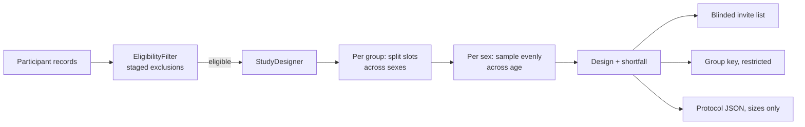

# Recall Study Generator

[](https://github.com/dsugurtuna/recall-study-generator/actions/workflows/ci.yml)

Select participants into genotype groups for a recall-by-genotype study, balanced on sex and spread across age within each group, with staged eligibility filtering and blinded participant lists.

> **Portfolio project.** Demonstrates generalised recall study design workflows. No real participant data is included.

**Where this fits:** part of my clinical genomics and biobank data work.
[snp-feasibility-checker](https://github.com/dsugurtuna/snp-feasibility-checker) and
[ld-linkage-mapper](https://github.com/dsugurtuna/ld-linkage-mapper) establish who has usable
genotype data; this repo turns that into a recall design; and
[biobank-data-release-manager](https://github.com/dsugurtuna/biobank-data-release-manager) handles
data extraction afterwards.

## The problem

In a recall-by-genotype study, researchers invite participants back based on their genotype, for
example a set number from each APOE group. The selection has to respect consent and eligibility,
give groups that are comparable on basic demographics, and be reproducible. The people sending
invitations should not be able to tell who is in which group.

## What this does

- **Staged eligibility** (`EligibilityFilter`): ordered exclusion rules, with a count excluded at
  each stage and the eligible records passed on.
- **Group selection** (`StudyDesigner`): up to N per genotype group from consented participants in
  an age window. Within each group, slots are split across sexes as evenly as the pool allows, then
  each sex is sampled evenly across its age range. Selection is deterministic.
- **Shortfall reporting**: groups with too few eligible people are reported, not padded.
- **Outputs** (`ProtocolGenerator`): a protocol skeleton as JSON (group sizes, no IDs), and the
  participant list as CSV, optionally blinded (IDs only, sorted by ID).

## Quickstart

```bash
git clone https://github.com/dsugurtuna/recall-study-generator.git
cd recall-study-generator
python -m venv .venv && source .venv/bin/activate
pip install -e ".[dev]"
pytest
python examples/demo.py
```

The demo builds a 600-person synthetic cohort by arithmetic (no randomness, no real data). Output,
checked by `tests/test_demo.py`:

```text
Cohort: 600; eligible: 487
  excluded at withdrawn: 21
  excluded at under_18: 15
  excluded at over_80: 77

e3/e3: 20 selected; F=10, M=10; ages 18-80
e3/e4: 20 selected; F=10, M=10; ages 18-80
e4/e4: 12 selected; F=8, M=4; ages 21-76  (short by 8)

{"study_name": "Synthetic APOE recall", "groups": {"e3/e3": 20, "e3/e4": 20, "e4/e4": 12}}
```

The small e4/e4 group cannot reach 20, so it takes everyone eligible and reports the shortfall.

To export lists:

```python
from recall_gen import ProtocolGenerator

ProtocolGenerator.export_participant_list(design, "invite_list.csv", blinded=True)   # for invitations
ProtocolGenerator.export_participant_list(design, "group_key.csv")                   # restricted key
```

## How it works



## Design decisions

- **Spread across age, do not sort and truncate.** The first version sorted by age and took the
  first N, which selected the youngest people in every group. Even spacing across the age-sorted
  pool keeps each group's age profile close to its pool's.
- **Split by sex first.** Sex is a strong confounder for many phenotypes. Balancing within each group
  is simple and explainable; slots a small stratum cannot fill go to the other stratum.
- **Deterministic selection.** The same input gives the same design, so a design can be re-derived
  and audited. Ties are broken by participant ID.
- **Report shortfall, never pad.** Relaxing criteria to fill a group is a study decision, not
  something code should do quietly.
- **Blinded export.** Staff who invite participants should not learn genotypes. Without a group
  column and with rows sorted by ID, neither the columns nor the order reveal the group.
- **Protocol JSON holds sizes, not IDs.** The protocol is shared more widely than the participant
  key.

## Limitations and what this is not

- Balancing is *within* groups. Groups are not matched to each other on age or sex; if pools differ,
  so will the groups.
- Ethnicity and genetic ancestry are not used. Ancestry can confound genotype-phenotype
  comparisons, so an ancestry-aware design needs more than this tool.
- Consent is a single status field. Real recall depends on consent scope for recontact, ethics
  approval and the study's policy on returning results, none of which are modelled.
- Expected response rates are not modelled; invite more people than the target where needed.
- The protocol generator fills template text. It is a skeleton, not a protocol.

## Roadmap

- Optional frequency matching of age and sex across groups.
- Over-recruitment factors per group with a reserve list.
- A CLI that reads a participant CSV and writes the three outputs.

## Development

```bash
make dev     # install with dev dependencies
make check   # ruff lint and format check, mypy, pytest
```

See [docs/WHY.md](docs/WHY.md) for the reasoning behind the design, and
[CONTRIBUTING.md](CONTRIBUTING.md) to contribute.

## Licence

MIT is declared in `pyproject.toml`, but no licence file is included yet.

---

Personal project by [Ugur Tuna](https://github.com/dsugurtuna). Not affiliated with or endorsed by any employer.
